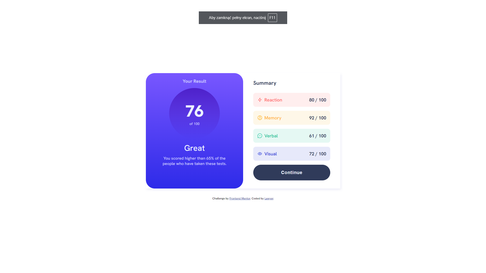

# Frontend Mentor - Results summary component solution

This is a solution to the [Results summary component challenge on Frontend Mentor](https://www.frontendmentor.io/challenges/results-summary-component-CE_K6s0maV). Frontend Mentor challenges help you improve your coding skills by building realistic projects. 

## Table of contents

- [Overview](#overview)
  - [The challenge](#the-challenge)
  - [Screenshot](#screenshot)
  - [Links](#links)
- [My process](#my-process)
  - [Built with](#built-with)
  - [What I learned](#what-i-learned)
  - [Continued development](#continued-development)
- [Author](#author)


## Overview

### The challenge

Users should be able to:

- View the optimal layout for the interface depending on their device's screen size
- See hover and focus states for all interactive elements on the page

### Screenshot




### Links

- Solution URL: [Add solution URL here](https://github.com/Czekol/resultSummary)
- Live Site URL: [Add live site URL here](https://czekol.github.io/resultSummary/)

## My process

### Built with

- Semantic HTML5 markup
- CSS custom properties
- Flexbox
- Mobile-first workflow
- JavaScrpit ES6 

**Note: These are just examples. Delete this note and replace the list above with your own choices**

### What I learned

I learned how to add transiction while hover in linear gradient and also 
i expanded my knowledge in JavaScrpit while working on objects from the file data.json


```css
.button {
	position: relative;
	width: 100%;
	background: var(--dark-gray-blue);
	color: var(--pale-blue);
	padding: 1.3rem 1rem;
	border-radius: 40px;
	border: none;
	font-size: 1.1rem;
	font-weight: 700;
	letter-spacing: 1px;
	overflow: hidden;
	z-index: 1;
}

.button:after {
	content: '';
	z-index: -1;
	position: absolute;
	left: 0;
	top: 0;
	right: 0;
	bottom: 0;
	background: var(--bright-gradient);
	opacity: 0;
	transition: all 1s ease-in-out;
	overflow: hidden;
}

.button:hover:after {
	opacity: 1;
}
```
```js
const icons = document.querySelectorAll('.icon');
const skillNames = document.querySelectorAll('.skill-name');
const skillResults = document.querySelectorAll('.skill-result');

fetch('data.json')
	.then(response => response.json())
	.then(data => {
		for (const key in data) {
			skillNames[key].textContent =  Object.values(data[key])[0];
			skillResults[key].textContent = `${Object.values(data[key])[1]} / 100`;
			icons[key].setAttribute('src', Object.values(data[key])[2]);
		}
	});
```


### Continued development

website responsiveness media Query | clamp itd 


## Author

- Frontend Mentor - [@Lawyer](https://www.frontendmentor.io/profile/Czekol)


